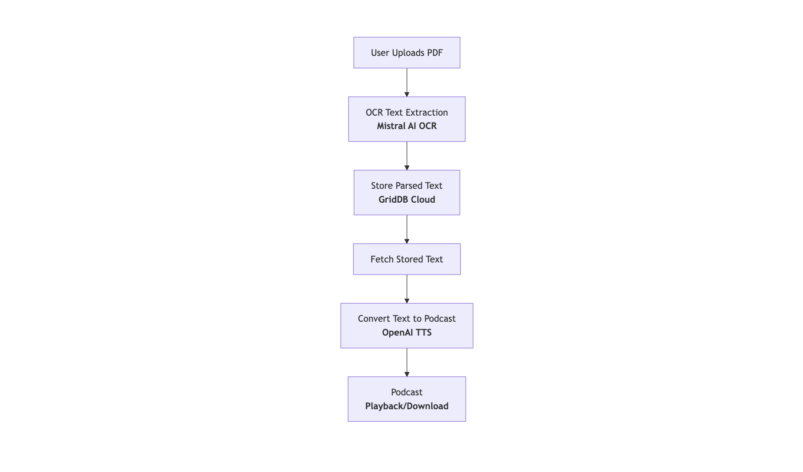

# Generate Podcast from PDF using AI


## Introduction

- Brief introduction to the growing popularity of podcasts in content marketing and learning.
- Highlight the effort and time involved in manually converting documents into podcasts.
- **Solution**: Introduce an AI-powered approach for turning PDFs into podcast audio using OCR, text-to-speech (TTS), and database tools.

## Problems with Converting PDFs to Podcasts Manually

### Time-consuming PDF Parsing

- Discuss manual extraction of text from PDFs and how tedious it is.
- Challenges with large or complex PDFs (tables, formatting, etc.).

### Poor Text-to-Speech Quality

- Problems with available non-AI based speech synthesis tools (unnatural speech).
- Need for high-quality, voice-friendly podcast output.

### Managing and Storing PDF Content

- Difficulties effectively storing and retrieving large-scale PDF data.

## Introducing the AI-powered PDF-to-Podcast Generation System

### High-level Workflow

Explain the general AI-powered workflow with a clear visual diagram illustration:



### Main AI Tools & Stack Used

- **Next.js**: Web framework for building the user-interface and the API layer.
- **Mistral OCR AI**: OCR model for high-quality, accurate PDF-to-text conversion.
- **GridDB Cloud**: Database for efficiently storing and retrieving parsed PDF text.
- **OpenAI TTS**: High-quality, lifelike speech synthesis for converting extracted text to audio.

----

## Prerequisites

### Setting up Next.js

- Using Next.js latest LTS version. Installation commands and basics.

### GridDB Cloud Setup

- Explanation of GridDB Cloud purpose in our setup: managing parsed text data for easy retrieval and regeneration.
- Quick-start link & credentials guide.

### OpenAI TTS API Setup

- How to obtain OpenAI API keys.
- Quick start on using OpenAI's TTS models.

### Mistral OCR API Setup

- Key features and advantages of using Mistral OCR.
- How to obtain API key and setup instructions.

----

## Building the Podcast Generator Step-by-Step

### 1. Developing the Next.js Web Interface & API

- Describe Next.js frontend UI pages for uploading PDFs and display generated podcasts.
- Show file upload components and preview components.

Code snippet example to create Next.js API route:

```javascript
// Next.js API route example
import { NextResponse } from 'next/server';

export async function POST(req) {
  const data = await req.formData();
  const file = data.get('pdfFile');

  if (!file) {
    return NextResponse.json({ error: 'No PDF file uploaded' }, { status: 400 });
  }

  // Call OCR API and Database storage (handled in next sections)

  return NextResponse.json({ message: 'PDF Uploaded Successfully' });
}
```

### 2. Integrating OCR using Mistral AI

- OCR process: converting the uploaded PDF into structured text.
- Include the process of sending PDF to Mistral OCR API, receiving extracted text.

Sample OCR API call via Axios in Next.js:

```javascript
import axios from 'axios';

async function parsePDF(file) {
  const formData = new FormData();
  formData.append('file', file);

  const response = await axios.post('https://api.mistral.ai/ocr', formData, {
    headers: {
      'API-Key': process.env.MISTRAL_OCR_API_KEY,
      'Content-Type': 'multipart/form-data',
    },
  });

  return response.data.text;
}
```

### 3. Storing & Retrieving Parsed Text with GridDB Cloud

- Define the schema for storage:

```json
// GridDB schema example
{
  "id": "string",
  "pdfName": "string",
  "extractedText": "text",
  "uploadDate": "timestamp"
}
```

- Saving and fetching data using GridDB RESTful APIs (SQL-like queries examples):

```javascript
// Insert query example
const sqlInsert = `INSERT INTO pdftexts (id, pdfName, extractedText, uploadDate) VALUES (?, ?, ?, ?)`;
```

```javascript
// Retrieve query example
const sqlSelect = `SELECT * FROM pdftexts WHERE id=?`;
```

### 4. Generating Podcast using OpenAI TTS

- Explain converting the extracted text to audio using OpenAI's state-of-the-art TTS model.
- Show OpenAI API usage for audio conversion:

```javascript
// OpenAI TTS call example
import axios from 'axios';

async function generatePodcast(textContent) {
  const response = await axios.post(
    "https://api.openai.com/v1/audio/speech",
    {
      model: "tts-1",
      input: textContent,
      voice: "alloy"
    },
    {
      headers: {
        'Authorization': `Bearer ${process.env.OPENAI_API_KEY}`,
        'Content-Type': 'application/json'
      },
      responseType: 'arraybuffer'
    }
  );

  return response.data;  //binary audio data
}
```

### 5. Integrating Entire Workflow End-To-End

- Combine all above steps into one seamless Next.js backend API endpoint:

```javascript
// Example pseudocode flow for complete podcast generation
export async function POST(req) {
  const file = req.formData().get('pdfFile');

  const extractedText = await parsePDF(file); // Mistral AI OCR parsing
  
  // Save extracted text in GridDB
  await saveExtractedTextToGridDB(file.name, extractedText);

  const podcastAudio = await generatePodcast(extractedText);

  return new NextResponse(podcastAudio, {
    headers: { 'Content-Type': 'audio/mpeg' }
  });
}
```

- Provide frontend example code snippets to filter, preview, and download podcast audio.

----

## Running your Podcast Generator Prototype

- Step-by-step procedure:
  - Cloning repository
  - Installing dependencies (`npm install`)
  - Setting up environment `.env` variables (OpenAI, Mistral OCR, GridDB URLs and Keys)
  - Running locally: `npm run dev`
  - Viewing and testing your AI-powered app via browser.

----

## Possible enhancements

- **Custom Voice Options**: Provide users the option for different voices or accents.
- **Text summarization for shorter podcasts**: Integrate text summarization AI to create succinct podcast content.
- **Podcast hosting integration**: Connect your podcasts directly to platforms like Spotify, Apple Podcasts, RSS feeds, etc.
- **Improved UI/UX**: Provide users better controls over file management & audio playback.

----

## Conclusion

- Summarize how the stack (Next.js, GridDB Cloud, Mistral OCR, and OpenAI TTS) effectively solves manual generation limitations.
- Encourage developers and organizations to extend this prototype to production-ready deployments.

----

### Final Thoughts & Resources

- GitHub repository link for demo project code
- Links to official APIs documentation (GridDB Cloud, Mistral OCR, OpenAI TTS, Next.js)
- Additional resources for further exploration (blogs, papers, articles, etc.)