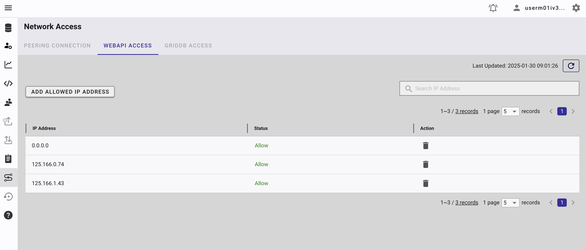

# Generate Podcast from PDF using AI


## Quick Links

- [Introduction](#why-this-project)
- [Problem & Why This Matter](#problem--why-this-matters)
- [Introducing the AI-powered PDF-to-Podcast Generation System](#introducing-the-ai-powered-pdf-to-podcast-generation-system)
- [Run the Project](#run-the-project)
- [Prerequisites](#prerequisites)
  - [Node.js](#nodejs)
  - [Mistral OCR API Setup](#mistral-ocr-api-setup)
  - [OpenAI API Setup](#openai-api-setup)
  - [GridDB Cloud Setup](#griddb-cloud-setup)
    - [Sign Up for GridDB Cloud Free Plan](#sign-up-for-griddb-cloud-free-plan)
    - [GridDB WebAPI URL](#griddb-webapi-url)
    - [GridDB Username and Password](#griddb-username-and-password)
    - [IP Whitelist](#ip-whitelist)
- [Building the Podcast Generator](#building-the-podcast-generator)
  - [Developing the Next.js Web Interface & API](#developing-the-nextjs-web-interface--api)
    - [OCR Extraction of PDF Content](#1-ocr-extraction-of-pdf-content)
    - [Generating the Podcast Script](#2-generating-the-podcast-script)
    - [Creating Audio from the Generated Script](#3-creating-audio-from-the-generated-script)
    - [Saving Data to GridDB Database](#4-saving-data-to-griddb-database)
  - [Integrating OCR using Mistral AI](#integrating-ocr-using-mistral-ai)
  - [Get PDF key points and summarization using OpenAI](#get-pdf-key-points-and-summarization-using-openai)
  - [Generating Podcast using OpenAI TTS](#generating-podcast-using-openai-tts)
  - [Storing Data to GridDB Cloud](#storing-data-to-griddb-cloud)
- [User Interface](#user-interface)
  - [Upload & Convert PDF](#1-upload--convert-pdf)
  - [Podcast Result](#2-podcast-result)
- [Possible enhancements](#possible-enhancements)
- [Resources](#resources)

## Why This Project?

Turn your complex PDFs into clear, natural-sounding AI-powered podcasts instantly. Ideal for busy professionals, auditory learners, and passive learning workflows.

Core Benefits:

- Hands-free learning, ideal during commutes or chores.

- Easily transforms technical PDFs into engaging audio.

- Drastically reduces content-creation time.

## Problem & Why This Matters

Converting PDFs manually is tedious:

- Difficult text extraction from PDFs.
- Complex manual summarization and audio recording overhead.
- Messy PDF management/storage.


Your AI-powered podcast solution automates every step—solving these clearly.


## Introducing the AI-powered PDF-to-Podcast Generation System


The diagram above illustrates the simplified workflow of the AI-powered PDF-to-podcast system:

1. **User Uploads PDF**: The user submits a PDF document to the platform.

2. **OCR Text Extraction (Mistral AI OCR)**: Mistral AI OCR accurately extracts the text content from the uploaded PDF.

3. **Summarize Content (OpenAI)**: The extracted text is summarized by OpenAI to simplify complex content for easier listening.

4. **Convert Text to Podcast (OpenAI TTS)**: OpenAI's Text-to-Speech converts the summarized text into natural, engaging audio.

5. **Store Data (GridDB Cloud)**: The summarized text and associated data are efficiently stored in the GridDB Cloud for future retrieval.

6. **Podcast Playback**: Users access the simplified, engaging podcast directly for convenient listening.

## Run the Project

To run this project, you should clone the `apps` directory from this [repository](https://github.com/junwatu/griddb-podcast-creator.git). 

```shell
git clone https://github.com/junwatu/griddb-podcast-creator.git
cd griddb-podcast-creator
cd apps
npm install
```

Create a `.env` file for the project credentials with these keys:

```ini
MISTRAL_API_KEY=
OPENAI_API_KEY=
GRIDDB_WEBAPI_URL=
GRIDDB_PASSWORD=
GRIDDB_USERNAME=
```

You need the Mistral API key for OCR functionality, the OpenAI key for the text-to-speech (TTS) conversion, and GridDB keys for the data storage. Please, look in this [section](#prerequisites) on how to get those keys.

Run the project using this command:

```shell
npm run dev
```

Go to the default app URL `http://localhost:3000`


Browse for the PDF file and click the **Convert to Podcast** button to generate podcast.


## Prerequisites

### Node.js

You need Node.js installed because this project uses Next.js. Install the Node LTS version from [here](https://nodejs.org/id/download).


### Mistral OCR API Setup

A Mistral API key is needed to use the OCR functionality. Create the API key [here](https://console.mistral.ai/api-keys).

### OpenAI API Setup

Create the OpenAI API key [here](https://platform.openai.com/). You may need create a project and enable few models.


In this project, we will use two AI models from OpenAI:

- `gpt-4o` to create audio script.
- `gpt-4o-mini-tts` for generating audio from the script. 

### GridDB Cloud Setup

The GridDB Cloud offers a free plan tier and is officially available worldwide.

You need these GridDB environment variables in the `.env` file:

```ini
GRIDDB_WEBAPI_URL=
GRIDDB_USERNAME=
GRIDDB_PASSWORD=
```


#### Sign Up for GridDB Cloud Free Plan

If you would like to sign up for a GridDB Cloud Free instance, you can do so in the following link: [https://form.ict-toshiba.jp/download_form_griddb_cloud_freeplan_e](https://form.ict-toshiba.jp/download_form_griddb_cloud_freeplan_e).

After successfully signing up, you will receive a free instance along with the necessary details to access the GridDB Cloud Management GUI, including the **GridDB Cloud Portal URL**, **Contract ID**, **Login**, and **Password**.

#### GridDB WebAPI URL

Go to the GridDB Cloud Portal and copy the WebAPI URL from the **Clusters** section. It should look like this:


#### GridDB Username and Password

Go to the **GridDB Users** section of the GridDB Cloud portal and create or copy the username for `GRIDDB_USERNAME`. The password is set when the user is created for the first time, use this as the `GRIDDB_PASSWORD`.


For more details, to get started with GridDB Cloud, please follow this [quick start guide](https://griddb.net/en/blog/griddb-cloud-quick-start-guide/).

#### IP Whitelist
When running this project, please ensure that the IP address where the project is running is whitelisted. Failure to do so will result in a 403 status code or forbidden access.

You can use a website like [What Is My IP Address](https://whatismyipaddress.com/) to find your public IP address.

To whitelist the IP, go to the GridDB Cloud Admin and navigate to the **Network Access** menu.



## Building the Podcast Generator

### Developing the Next.js Web Interface & API

The main important code is the API route that handles PDF upload and then processes it. This is the snippet code from the `route.ts` file in the `apps/app/api/upload` directory:

```typescript
export async function POST(request: NextRequest) {
  try {
    const formData = await request.formData();
    const file = formData.get('file') as File;

    if (!file) {
      return NextResponse.json(
 { error: 'No file uploaded' },
 { status: 400 }
 );
 }

    if (file.type !== 'application/pdf') {
      return NextResponse.json(
 { error: 'Invalid file type. Please upload a PDF file' },
 { status: 400 }
 );
 }

    const maxSize = 10 * 1024 * 1024; // 10MB in bytes
    if (file.size > maxSize) {
      return NextResponse.json(
 { error: 'File size too large. Maximum size is 10MB' },
 { status: 400 }
 );
 }

    const bytes = await file.arrayBuffer();
    const buffer = Buffer.from(bytes);
    const timestamp = Date.now();
    const randomString = Math.random().toString(36).substring(7);
    const tempFilename = `upload_${timestamp}_${randomString}.pdf`;
    const tempFilePath = join(os.tmpdir(), tempFilename);

    await writeFile(tempFilePath, buffer);
    
    /** Extracted data from PDF */
    const { content: pdfContent, response: ocrResponse } = await ocrService.processFile(tempFilePath, file.name);
    
    /** Generate script for the audio from the extracted data */
    const audioScript = await openaiService.generatePodcastScript(pdfContent);
    
    /** Generate audio from the script */
    const audioFiles = await generatePodcastAudio(audioScript, process.env.OPENAI_API_KEY || '', {
      voice: 'verse',
      outputDir: audioDir,
      instructions: instructions,
      outputFormat: 'mp3',
 });

    const cleanedAudioFiles = cleanAudioPaths(audioFiles);
    
    /** Save the data into GridDB database */
    const podcastData: GridDBData = {
      id: generateRandomID(),
      audioFiles: JSON.stringify(cleanedAudioFiles),
      audioScript: JSON.stringify(audioScript),
      // ts ignore
      // @ts-ignore
      ocrResponse: JSON.stringify(ocrResponse)
 }

    const result = await dbClient.insertData({ data: podcastData });
    
    return NextResponse.json({
      message: 'File uploaded successfully',
      fileName: file.name,
      fileSize: file.size,
      tempFilePath: tempFilePath,
      ocrResponse: ocrResponse,
      audioFiles: audioFiles,
      audioScript: audioScript,
 });

 } catch (error) {
    console.error('Error uploading file:', error);
    return NextResponse.json(
 { error: 'Failed to upload file' },
 { status: 500 }
 );
 }
}
```

Let's look at the code in detail:

#### 1. **OCR Extraction of PDF Content**  

```typescript
/** Extracted data from PDF */
const { content: pdfContent, response: ocrResponse } = await ocrService.processFile(tempFilePath, file.name);
```
- **Function:** The temporary PDF file created earlier is sent to an OCR (Optical Character Recognition) service for processing.
- **Outcome:** OCR extracts textual content (`pdfContent`) from the PDF and provides a detailed response (`ocrResponse`) with metadata, including extraction success, any encountered OCR errors, or issues about content quality that might impact accuracy.

#### 2. **Generating the Podcast Script**  

```typescript
/** Generate script for the audio from the extracted data */
const audioScript = await openaiService.generatePodcastScript(pdfContent);
```
- **Function:** Pass the extracted textual content (`pdfContent`) to an OpenAI-powered service.
- **Outcome:** A structured podcast script (`audioScript`) suitable for text-to-speech conversion is generated, optimized for clarity, conversational quality, and audio flow.

#### 3. **Creating Audio from the Generated Script**  

```typescript
/** Generate audio from the script */
const audioFiles = await generatePodcastAudio(audioScript, process.env.OPENAI_API_KEY || '', {
    voice: 'verse',
    outputDir: audioDir,
    instructions: instructions,
    outputFormat: 'mp3',
});
```
- **Function:** Convert the generated podcast script into audio form using an OpenAI text-to-speech API.
- **Parameters:**
  - `voice`: Determines vocal style (e.g., 'verse').
  - `outputDir`: Destination directory for audio files.
  - `instructions`: Extra refinement or instructional parameters for audio quality.
  - `outputFormat`: Audio format set as 'mp3'.
- **Outcome:** Audio segments (`audioFiles`) in MP3 format are generated from the script and stored in the designated output directory.

#### 4. **Saving Data to GridDB Database**  
```typescript
/** Save the data into GridDB database */
const podcastData: GridDBData = {
    id: generateRandomID(),
    audioFiles: JSON.stringify(cleanedAudioFiles),
    audioScript: JSON.stringify(audioScript),
    // ts ignore
    // @ts-ignore
    ocrResponse: JSON.stringify(ocrResponse)
}

const result = await dbClient.insertData({ data: podcastData });
```
- **Function:** Collect and organize processed data (ID, audio files, podcast script, OCR response) into a structured object (`podcastData`) with appropriate type conversions (JSON serialization).
- **Outcome:** Persistently stores generated audio metadata, associated scripts, and OCR extraction data into the GridDB database, providing future retrieval and management capabilities.

In summary, the main functionality follows a clear sequence from our [system diagram](#introducing-the-ai-powered-pdf-to-podcast-generation-system) before.

### Integrating OCR using Mistral AI

Mistral OCR is an Optical Character Recognition API that sets a new standard in document understanding. Unlike other models, Mistral OCR comprehends each element of documents—media, text, tables, equations—with unprecedented accuracy and cognition. It takes images and PDFs as input and extracts content in an ordered interleaved text and images.

In this project, we will use Mistral OCR to extract text from PDFs. The process involves:

#### 1. Uploading the PDF file to Mistral.

```javascript
const uploaded_pdf = await this.client.files.upload({
    file: {
        fileName: fileName,
        content: file,
 },
    purpose: "ocr"
});
```

#### 2. Retrieving the signed URL for the uploaded PDF.

```javascript
const signedUrl = await this.client.files.getSignedUrl({
    fileId: uploaded_pdf.id,
});
```

#### 3. Sending the signed URL to Mistral OCR for text extraction.

```javascript
const ocrResponse = await this.client.ocr.process({
    model: "mistral-ocr-latest",
    document: {
        type: "document_url",
        documentUrl: signedUrl.url,
 }
});
```

### Get PDF key points and summarization using OpenAI

We won't convert all the content of the PDF extraction text because it will be to long. The best way is to summarize and get the key points of the extraction data. For this task, we will use the `gpt-4o` model.

This is the system prompt to extract meaningful data from PDF's extracted data:

```txt
Create a 5-minute podcast episode script in a conversational style, using the content provided.\n\nInclude the following elements:\n\n- **Introduction**: Engage your audience with an intriguing opening statement related to the topic. Capture their attention immediately.\n\n- **Main Talking Points**: Develop 3-4 main sections discussing the central ideas or arguments. Use relatable examples and personal stories for better understanding. Maintain a conversational tone, as if you are speaking directly to the listener. Ensure natural transitions between sections to keep the flow.\n\n- **Conclusion**: Summarize the key takeaways in a concise manner, making sure to leave a lasting impression.\n\n- **Call to Action**: End with a clear and compelling call to action encouraging listeners to engage further or reflect on the topic.\n\n# Output Format\n\nWrite the script in a conversational and engaging narrative suitable for a podcast. Each section should integrate seamlessly with transitions, emulate a direct speaking style to engage the listener, and reinforce the message.\n\n# Examples\n\n**Introduction**: \"Welcome to [Podcast Name]. Today, we're diving into [Topic]. Have you ever wondered...?\"\n\n**Main Talking Points**:\n\n1. \"Let's start with [Main Idea]. It's like when...\"\n2. \"Moving on to [Next Idea], consider how...\"\n3. \"Finally, when we talk about [Final Idea], there's a story about...\"\n\n**Conclusion**: \"So, as we've learned today, [Key Takeaway 1], [Key Takeaway 2]...\"\n\n**Call to Action**: \"Think about how you can [Action]. Join us next time when we explore...\"\n\n# Notes\n\n- The script should be written to cater both to novices and those with some prior knowledge.\n- Ensure it resonates intellectually and stimulates curiosity among listeners.\n- Use transition words to guide listeners smoothly from one idea to the next.
```

To keep the response consistent, we can use the schema feature. So, basically, we can force the AI model response to match a predefined data structure or schema:


```json
{
  "introduction": "Welcome to our podcast! Today, we're exploring how AI can revolutionize the way we consume content by transforming PDFs into engaging audio podcasts. Have you ever wished you could listen to your documents instead of reading them? Let's dive in!",
  "main_talking_points": [
 {
      "title": "The Challenges of Manual PDF-to-Podcast Conversion",
      "content": "Manually converting PDFs into podcasts is a tedious process. It involves extracting text, summarizing complex content, and recording audio—all of which take significant time and effort. AI simplifies this by automating these steps, saving you hours of work."
 },
 {
      "title": "How AI Simplifies the Process",
      "content": "AI tools like Mistral OCR and OpenAI TTS streamline the workflow. Mistral OCR extracts text from PDFs with high accuracy, while OpenAI's models summarize and convert the text into natural-sounding audio. This ensures a seamless and efficient process."
 },
 {
      "title": "The Role of GridDB in Managing Data",
      "content": "GridDB Cloud acts as a robust storage solution for parsed text and audio files. It ensures that your data is organized, easily retrievable, and ready for future use, making the entire system scalable and efficient."
 }
 ],
  "conclusion": "In summary, AI-powered tools are transforming the way we interact with content. By automating the conversion of PDFs into podcasts, we save time, enhance accessibility, and create a more engaging learning experience.",
  "call_to_action": "Think about how you can leverage this technology in your own projects. Visit our GitHub repository to get started, and don't forget to share your feedback!"
}
```

The `gpt-4o` will response data with these keys:

- `introduction`
- `main_talking_points`
- `conclusion`
- `call_to_action`

With this format then it will be easier to convert the text to audio for our podcast application.

### Generating Podcast using OpenAI TTS

We will use the `gpt-4o-mini-tts` model from OpenAI to generate speech from text. This model is capable of controlling the voice of your generated audio with additional [instructions](https://platform.openai.com/docs/api-reference/audio/createSpeech#audio-createspeech-instructions).

We will process the audio in two processes based on the schema response from the OpenAI model.

#### 1. Process `introduction`, `conclusion`, and `call_to_action`.

This code will process the introduction, conclusion, and call to action into audio.

```javascript
  const simpleKeys = ['introduction', 'conclusion', 'call_to_action'] as const;

  for (const key of simpleKeys) {
    try {
      const text = podcastData[key];
      const fileName = `${key}.${outputFormat}`;
      const speechFile = path.join(outputDir, fileName);

      const response = await openai.audio.speech.create({
        model,
        voice,
        instructions,
        input: text
 });

      const buffer = Buffer.from(await response.arrayBuffer());
      fs.writeFileSync(speechFile, buffer);

      audioFiles[key] = speechFile;
 } catch (error) {
      console.error(`Error processing ${key}:`, error);
      throw error;
 }
 }

```

#### 2. Process `main_talking_points`

This code will process the main content or talking points into audio.

```javascript

  // Process main talking points separately
  if (Array.isArray(podcastData.main_talking_points)) {
    for (let i = 0; i < podcastData.main_talking_points.length; i++) {
      try {
        const point = podcastData.main_talking_points[i];
        const text = point.content;
        const fileName = `talking_point_${i}.${outputFormat}`;
        const speechFile = path.join(outputDir, fileName);

        const response = await openai.audio.speech.create({
          model,
          voice,
          instructions,
          input: text
 });

        const buffer = Buffer.from(await response.arrayBuffer());
        fs.writeFileSync(speechFile, buffer);

        audioFiles[`talking_point_${i}`] = speechFile;
 } catch (error) {
        console.error(`Error processing talking point ${i}:`, error);
        throw error;
 }
 }
```

### Storing Data to GridDB Cloud

The column data or schema for the GridDB database is simple:

```ts
export interface GridDBData {
  id: string | number;
  ocrResponse: Blob;
  audioScript: string;
  audioFiles: string;
}
```

Then to save data to the GridDB, in this project the code is in the `insertData` function:

```javascript
async function insertData({
  data,
  containerName = 'podcasts',
}: {
  data: GridDBData;
  containerName?: string;
}): Promise<GridDBResponse> {
  console.log(data);
  try {
    const row = [
      parseInt(data.id.toString(), 10),
      data.ocrResponse,
      data.audioScript,
      data.audioFiles,
 ];

    const path = `/containers/${containerName}/rows`;
    return await makeRequest(path, [row], 'PUT');
 } catch (error) {
    if (error instanceof GridDBError) {
      throw error;
 }
    const errorMessage = error instanceof Error ? error.message : 'Unknown error';
    throw new GridDBError(`Failed to insert data: ${errorMessage}`, undefined, undefined, error);
 }
}
```

The core code actually just PUT operation on REST route path `/containers/podcasts/rows`. It's so easy to use GridDB on the cloud.

The full source code for saving data into GridDB is in the `apps/app/lib/griddb.ts` file. This file later will be used in the `route.ts` file as an API.

## User Interface

The code for the user interface resides in a single file, `page.tsx`. It is developed using React and Shadcn components, featuring two primary tabs:

### 1. Upload & Convert PDF


The user will browse and upload a PDF file. Once the file is selected, the user can click the **Convert to Podcast** button. This action will make the application process the PDF using OCR to extract text and then generate an audio podcast using AI-generated voices.

You can test the application using the sample PDF files available in the `pdfs` directory. These files are sourced from arXiv and contain highly technical content, making them ideal for evaluating the application's capabilities.

### 2. Podcast Result


After successful conversion, in the **Your Podcasts** tab the user can listen to the podcast, using the audio player and section list to navigate through the content easily.


## Possible enhancements

- **Custom Voice Options**: Provide users the option for different voices or accents.
- **Podcast hosting integration**: Connect your podcasts directly to platforms like Spotify, Apple Podcasts, RSS feeds, etc.
- **Improved UI/UX**: Provide users better controls over file management & audio playback.


### Resources

- [Project source code](https://github.com/junwatu/griddb-podcast-creator).
- [GridDB Cloud Web API](https://github.com/griddb/webapi/blob/master/GridDB_Web_API_Reference.md), [Mistral OCR](https://docs.mistral.ai/capabilities/document/), [OpenAI TTS](https://platform.openai.com/docs/guides/text-to-speech), [Next.js](https://nextjs.org/docs).
